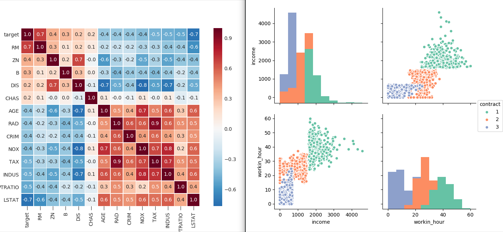

# Meetup Python - Visualisation de données

Meetup donné à **Bordeaux**. Introduction à la visualisation de données en Python.

Voir l'événement du 1er mars 2018 sur [meetup py-bdx](https://www.meetup.com/py-bdx/events/247587158/).

## Résumé

Ce meetup est une introduction à la visualisation de données. Avant de voir quelques
lignes de Python, on se posera quelques questions :

* quels sont les différents types de données ?
* quelle palette de couleurs choisir pour tel type de donnée ?
* comment rendre la compréhension de la donnée plus facile ?

J'illustrerai ensuite ces propos sur des jeux de donnée simples avec des
bibliothèques Python telles que pandas, matplotlib et seaborn. On verra ensemble
comment la visualisation peut aider à l'exploration de la donnée et à sa
compréhension.

Je présenterai aussi à partir des ces mêmes données d'autres bibliothèques de
visualisation en Python : Altair, HoloViews, plotly.

